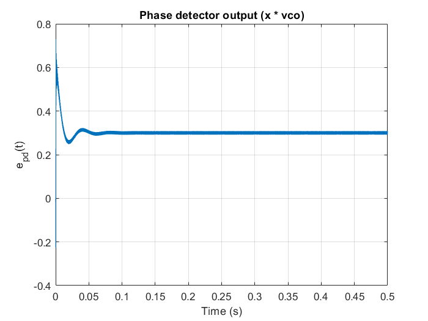
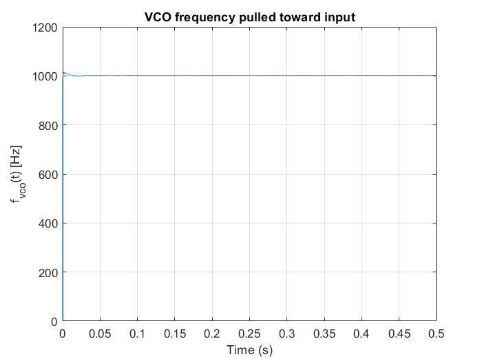
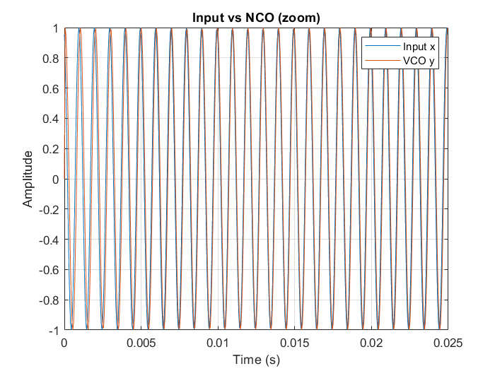

# Digital PLL – Phase Error & I/Q Phase Detector

This project continues the exploration of digital Phase-Locked Loops by focusing on **phase error behavior and quadrature detection**.

The goal here is to move one step deeper into PLL intuition — from observing frequency pulling to directly visualizing **true phase error convergence**.

---

## Overview

In this implementation, the PLL is built using:

- I/Q (quadrature) phase detector  
- First-order loop filter  
- Numerically Controlled Oscillator (NCO)  
- Closed-loop phase feedback  

The emphasis is on understanding:

- How phase error is generated  
- Why phase error approaches zero in lock  
- How frequency offset becomes a phase ramp  
- How loop filtering shapes convergence  

---

## System Structure

```
Input Signal
      ↓
I/Q Phase Detector
      ↓
Low-Pass Filter
      ↓
Loop Gain
      ↓
NCO (Phase Integrator)
      ↓
Feedback
```

---

## 1. Input Signal

A slowly varying or near-constant frequency cosine signal is used to clearly observe lock behavior and phase convergence.

---

## 2. I/Q Phase Detector

Instead of using a simple multiplier detector, we mix the input signal with:

- `cos(φ_vco)`  
- `sin(φ_vco)`  

After low-pass filtering:

- `I ≈ cos(Δθ)`  
- `Q ≈ sin(Δθ)`  

The phase error is computed as:

```matlab
phase_error = atan2(Q, I);
```

This provides a signed and directly interpretable phase difference:

```
phase_error ≈ θ_in − θ_vco
```

When the loop locks:

```
phase_error → 0
```

This makes lock behavior visually and conceptually clear.

---

## 3. Loop Filter

A first-order IIR low-pass filter smooths the phase detector output:

```matlab
u[n] = (1 - a) * e[n] + a * u[n-1];
```

The parameter `a` controls:

- Lock speed  
- Stability  
- Noise rejection  
- Transient oscillation  

---

## 4. NCO (Digital VCO)

The NCO integrates frequency into phase:

```matlab
φ[n+1] = φ[n] + 2π f_vco / fs;
```

The instantaneous frequency is controlled by:

```matlab
f_vco = f_initial + K_vco * control_signal;
```

This directly shows how frequency correction removes accumulated phase error.

---

## Visual Results

### Phase Error Convergence

The phase error decays smoothly toward zero as the PLL acquires lock.
<p align="center">
  
</p>

### VCO Frequency Tracking

The VCO frequency is pulled toward the input frequency and stabilizes after lock.
<p align="center">
  
</p>

### Input vs NCO Signal (After Lock)

When locked, the two signals align with minimal phase offset.
<p align="center">
  
</p>
---

## What This Demonstrates

- The relationship between frequency offset and phase ramp  
- Why PLLs are fundamentally phase control systems  
- How quadrature detection produces a clean error signal  
- How loop bandwidth affects convergence speed  
- How control signal DC level maintains frequency correction  

---

## 🧑‍💻 Author

**Arman Rajaei**
